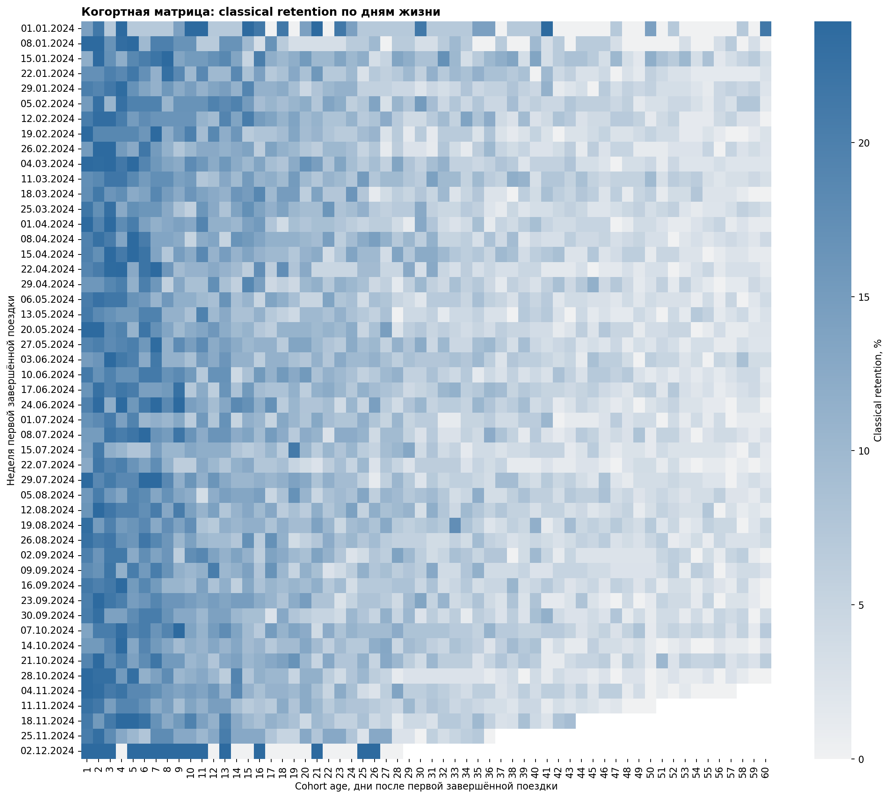
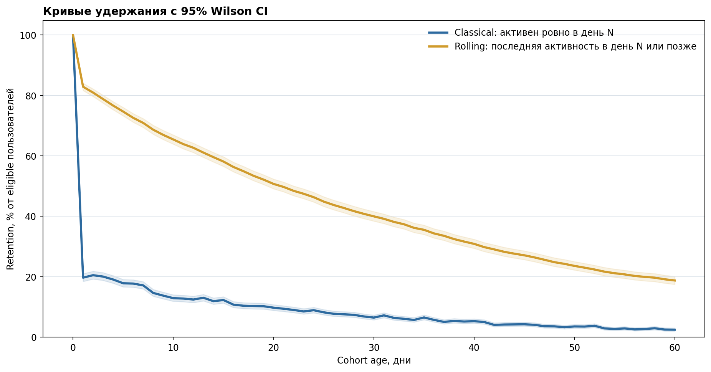
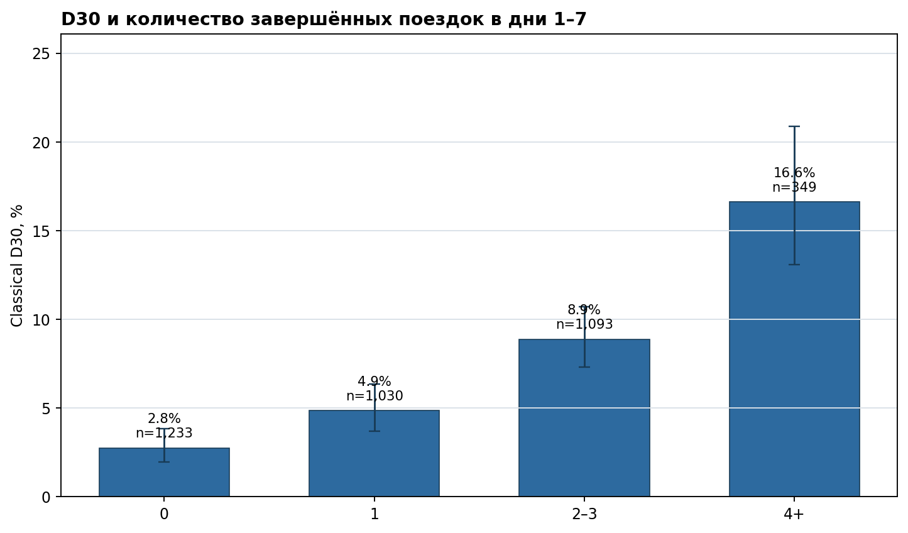
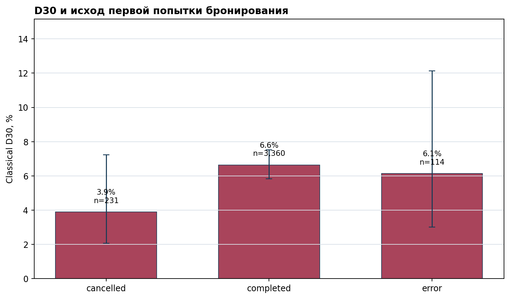
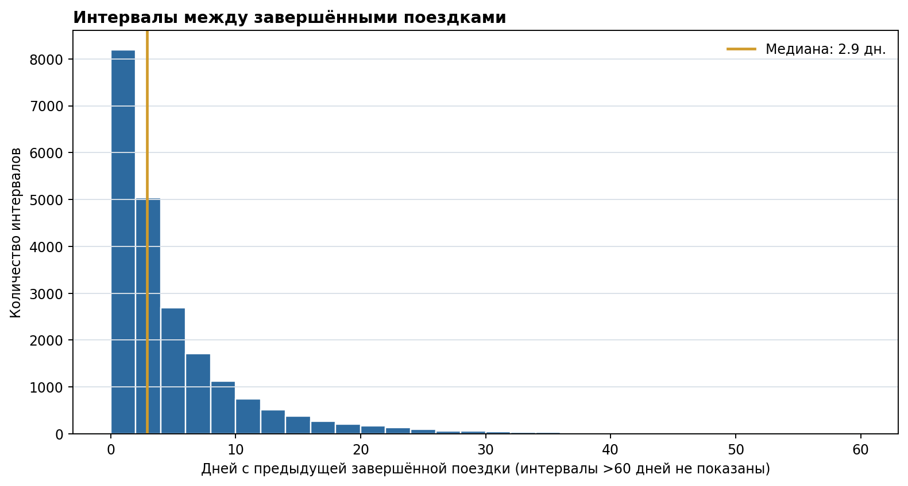

# Когорты, retention и повторные поездки

## Техническое резюме

- **Вывод для продукта:** сильнейший наблюдаемый ранний сигнал — повторные завершённые поездки в дни 1–7. У сегмента с 4+ такими поездками D30 составляет **16.6%** (95% CI 13.1%–20.9%, n=349) против **2.8%** у сегмента без повторной поездки (n=1,233); разница — **13.9 п.п.**
- **Это не причинный эффект.** В симуляции и в реальном продукте ранняя активность совместно определяется намерением пользователя, каналом и городом. Поэтому CRM не следует «приписывать» весь разрыв сообщению или фиче без эксперимента.
- **Первая попытка важна как качество воронки:** D30 среди активировавшихся после успешной первой попытки — **6.6%** (n=3,360); после отмены — **3.9%** (n=231); после ошибки — **6.1%** (n=114). Это приоритет для проверки надёжности оплаты/доступности, а не доказательство её causal lift.
- **Масштаб и измерение:** 6,000 синтетических регистраций, 26,449 попыток и 25,353 завершённых поездок до 2024-12-31. Aggregate D1 / D7 / D30 classical retention: **19.7% / 17.1% / 6.5%**; знаменатели соответственно n=3,709 / 3,709 / 3,705.

> Данные и все значения в этом кейсе синтетические и воспроизводимо генерируются из seed. Они не являются данными Делимобиля или другого реального оператора.

## Удержание: один вопрос — два разных определения

**Classical retention в день N** — доля пользователей, у которых есть хотя бы одна *завершённая* поездка ровно в календарный день `cohort_date + N`.

**Rolling retention в день N** — доля пользователей, у которых последняя наблюдаемая завершённая поездка приходится на день N или позже (то есть они были активны хотя бы один раз после наступления N). На D30 он равен **40.0%** и не сопоставим по уровню с classical D30: вопрос другой.

**Cohort age** — число полных календарных дней между датой первой завершённой поездки и датой рассматриваемой активности. В знаменатель для D1/D7/D30 попадает только пользователь, для которого соответствующая дата уже наступила к `data_end`; поздние когорты не ошибочно маркируются как churned из-за right censoring.

На heatmap по строкам — неделя первой завершённой поездки, по столбцам — cohort age. Пустые правые ячейки — ещё не достигнутые возраста когорты, а не нули retention.

Classical кривая отвечает на вопрос «есть ли активность в конкретный день» и поэтому ниже и более шумная. Rolling кривая похожа на survival-оценку наблюдаемой активности: она монотонна по определению и должна читаться только вместе с возрастной eligibility.

## Первая неделя — полезный триггер, но не «доказанная причина»

Сегменты заданы *до* D30: число завершённых поездок в дни 1–7 после первой завершённой поездки; D0 не входит в экспозицию. Столбцы показывают classical D30, линии — двусторонние Wilson 95% CI. Таким образом, здесь нет механического data leakage из дня 30 в ранний признак.

Интерпретация для CRM: отсутствие второй поездки в первую неделю — разумный **триггер для эксперимента**, а не сегмент, для которого можно заявить ожидаемый causal lift. Пользователи с высокой исходной потребностью и удобными маршрутами одновременно чаще совершают ранние поездки и возвращаются позднее; часть этого намерения не наблюдается в продуктовых логах.

## Фрикция первой попытки и частота повторов

Статус первой попытки бронирования задан до cohort date. Этот срез ограничен пользователями, которые всё же активировались первой завершённой поездкой; поэтому он дополнительно подвержен **selection/collider bias**: часть пользователей после неудачи не дошла до активации и исключена из retention-когорты. Для измерения полного влияния фрикции нужно отдельно мониторить регистрацию → первую попытку → первую завершённую поездку.

Медианный интервал между двумя завершёнными поездками — **2.9 дня**; **78.0%** интервалов не длиннее недели. SQL использует `ROW_NUMBER()` для нумерации поездок пользователя и `LAG()` для расчёта интервалов, а pandas агрегирует распределения и сегменты.

## Контекст привлечения: наблюдаемая неоднородность

Канал и город — pre-treatment признаки, поэтому их полезно сохранять в assignment и разрезах A/B-теста. Эти таблицы описывают **не скорректированные** D30 rates; они не доказывают, что сам канал или город вызывает разницу. Но они показывают, почему агрегированная связь ранней активности с D30 может смешивать разные типы пользователей и операционные условия.

| acquisition_channel | eligible n | Classical D30 | 95% CI |
|---|---:|---:|---:|
| organic | 1,154 | 6.7% | 5.4%–8.3% |
| paid_search | 831 | 6.6% | 5.1%–8.5% |
| partners | 472 | 9.1% | 6.8%–12.0% |
| referral | 710 | 5.6% | 4.2%–7.6% |
| social | 538 | 4.5% | 3.0%–6.6% |

| city | eligible n | Classical D30 | 95% CI |
|---|---:|---:|---:|
| Kazan | 680 | 5.4% | 4.0%–7.4% |
| Moscow | 1,642 | 7.6% | 6.4%–9.0% |
| Saint_Petersburg | 851 | 5.9% | 4.5%–7.7% |
| Yekaterinburg | 532 | 5.1% | 3.5%–7.3% |

## Данные, проверки и определения

**Источник:** [`scripts/generate_data.py`](../scripts/generate_data.py) с фиксированным seed `20240801`; лицензия кода — [MIT](../LICENSE). В генераторе нет персональных данных, а скрытая propensity не сохраняется в CSV намеренно: она моделирует остаточное смешение, которое аналитик обычно не может наблюдать.

**Гранулярность:** `users` — одна строка на регистрацию; `rides` — одна попытка бронирования. В retention участвуют только строки `status = completed`; отмена и ошибка остаются в `rides` для описания first-ride experience. Полное описание полей — в [`docs/data_dictionary.md`](../docs/data_dictionary.md).

**Качество входа:** все 8 базовых проверок прошли. Проверяются уникальность ключей, referential integrity, допустимые статусы, временная граница, обязательность `completed_at` у завершённых попыток и его отсутствие у неуспешных. Результат хранится в [`outputs/quality_checks.csv`](../outputs/quality_checks.csv).

**Две независимые реализации:** SQL из [`sql/`](../sql) выполняется в SQLite, а pandas повторяет cohort calculations. Pipeline останавливается, если классическая или rolling матрица не совпадает с SQL до `1e-6`, либо не совпадает D30-eligible population.

## Что проверять следующим экспериментом

1. **CRM для «нет второй поездки к D3».** Рандомизировать eligible активированных пользователей на control и один конкретный стимул: персональный маршрутный сценарий *или* кредит на следующую поездку (не смешивать механики). Основная метрика — classical D30; вторичные — rolling D30, поездки D1–7 и вклад в валовую маржу. Guardrails: отмены, payment errors, скидка на завершённую поездку, обращения в поддержку.
2. **Recovery первой ошибки.** При платёжной/разблокировочной ошибке рандомизировать понятный recovery flow: повтор оплаты/другая машина с сохранёнными параметрами против текущего опыта. Primary — first-completed-ride conversion за 24 часа; затем D30 среди всех назначенных пользователей (ITT), а не только активированных.
3. **Экспериментальный дизайн.** Единица рандомизации — `user_id`, assignment до показа триггера, один вариант на пользователя, стратификация по городу и acquisition channel. Предварительно зафиксировать окно наблюдения, исключения, остановку и multiple-metric policy. Анализировать ITT, публиковать effect size и 95% CI; не «переключать» метрику с D30 на более красивую постфактум.

## Ограничения и robustness checks

- Это синтетическая симуляция: её числа иллюстрируют метод, а не размер реальной возможности рынка.
- Связи ранней активности/первой попытки с D30 observational. Скрытая propensity, сезонность, доступность машин, цены, маршруты и коммуникации могут менять оценку; разрезы города и канала уменьшают, но не устраняют смешение.
- Classical retention чувствителен к календарному дню: пользователь с поездкой на D29 и D31 не retained на exact D30. Rolling менее строг, но отвечает на другой вопрос и зависит от окна наблюдения.
- Right censoring обрабатывается eligibility по каждому age; поэтому cohort size меняется вправо на матрице. Сравнивать когорты следует на общем наблюдаемом age, а не на «последней доступной» колонке.
- Для устойчивости pipeline сопоставляет SQL и pandas, использует Wilson CI вместо normal approximation и тестирует отсутствие D30 в признаке первых 7 дней. Это не заменяет A/B test.

## Следующие вопросы

- Как различаются first-completed-ride conversion и D30 по причинам отмены/ошибки, а не только по их общему статусу?
- Меняется ли эффект CRM по доступности машин рядом с пользователем, цене и типичному маршруту? Эти переменные нужны до назначения, чтобы избежать post-treatment segmentation.
- Какова unit economics-инкрементальность повторной поездки и размер скидки, при котором D30 lift окупается?
